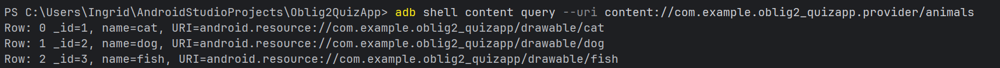

OBLIG 2 Quiz App

This app includes a gallery and a quiz. In the quiz the user need to select the correct animal name for the image. 
In the gallery the user can decide which photos to have. 

All the animals are stored in a Room database.

In task 2 I created a Provider-file with a class named QuizContentProvider.
This provider was tested using the Android Debug Bridge "adb". 

Screenshot of the output:

